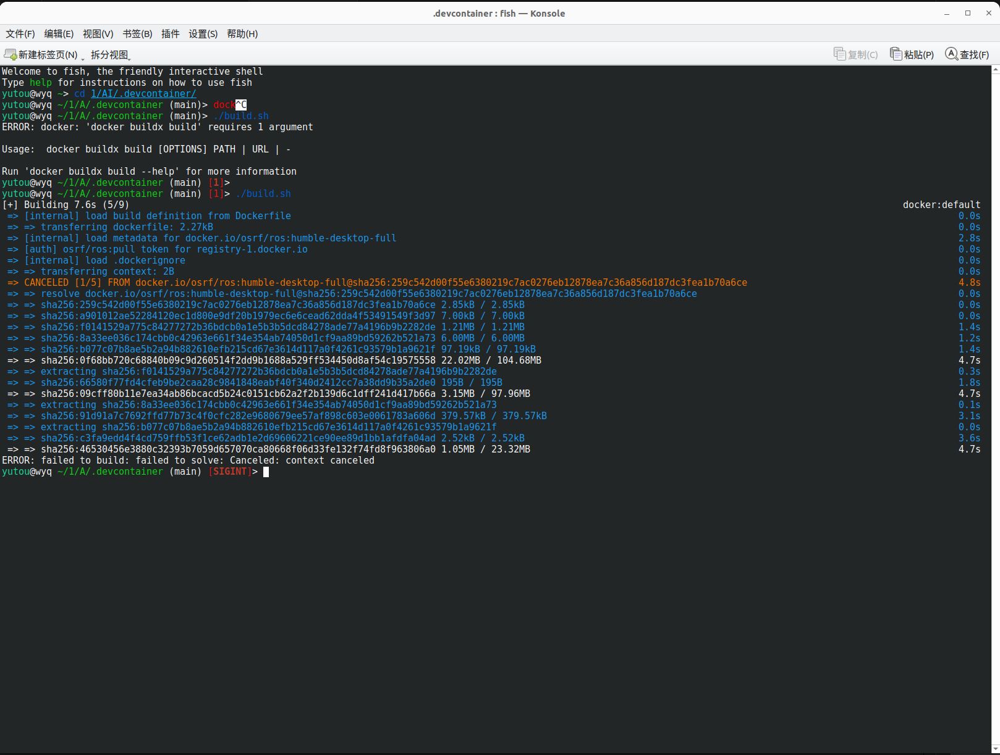

# AI

该仓库完成了人工智能大作业的导航要求
***
# Prerequisited
https://fishros.org.cn/forum/topic/20/%E5%B0%8F%E9%B1%BC%E7%9A%84%E4%B8%80%E9%94%AE%E5%AE%89%E8%A3%85%E7%B3%BB%E5%88%97
- 按照如上教程安装docker
- 上浏览器安装foxglove
## 使用教程
- git pull 拉取仓库到本地后进入项目根目录
- 进入.devcontainer/目录下
- 运行/build.sh构建镜像，如下图

- 构建成功之后仍然在该目录下运行
```
docker compose up
```

- 然后运行如下指令进入容器内
```
docker exec -it AI-container bash # 进入容器
colcon build # 工作环境下编译功能包
```


- 然后运行如下代码开启项目所需所有文件

```
ros2 launch turtle_nav turtle_nav_bringup.launch.py # 在一个终端中运行这行
ros2 run foxglove_bridge foxglove_bridge # 另开一个终端运行这个
```

- 点开本地的foxglove，选择8765这个端口

- 注意左侧任务栏所有话题都选择显示，即可看到效果图

- 想要通过foxglove发布运动指令还需要修改左侧任务栏中的发布一栏的2D pose修改成下图中的内容

- 最后就可以通过右上角的这个箭头发布目标点
